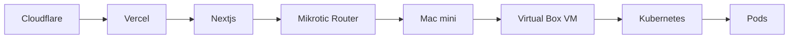

# 김재후 (Kim Jaehoo)

  
  ## 🚀 Dev Ops / ML Ops / SRE / Back-End Dev
  
  
  
  

---

## 💡 Professional Profile

> 개발은 결국 내가 원하는 것을 만드는 행위.  
> 나는 혼자서 모든 서비스를 구성해보고 싶어. 왜? 전체를 보는 눈이 있는게 실력이라고 생각하거든.  
> 그래서 진짜로 혼자 한다.  

맥미니를 활용해 집에서 물뮤(moolmeow) 서비스를 혼자 만든다.

이 모든 과정을 이해하고 구현할 수 있으면 어떤 트러블도 슈팅 가능하고 무엇이든 해결 못할까.  
추후에는 Flutter를 사용하여 앱 제작 + ML/DL로 사용자 맞춤 콘텐츠 제작 계획.  
이 모든 것을 혼자서 할 수 있을까? → 일단 해봐! → [kimvayne.xyz](https://kimvayne.xyz)에 모든 내용이 담겨 있다고!

---

## 🛠️ Key Skills

<table>
  <tr>
    <td><b>인프라 & 아키텍처</b></td>
    <td><b>개발 & API</b></td>
    <td><b>클라우드 & 도구</b></td>
  </tr>
  <tr>
    <td>
      ✅ Infrastructure 구축 및 관리 
      ✅ 마이크로 서비스 아키텍처 설계 
      ✅ Kubernetes 클러스터 운영 
      ✅ CI/CD 파이프라인 구축
    </td>
    <td>
      ✅ 데이터베이스 설계 및 최적화 
      ✅ API 설계 및 개발 
      ✅ L2 Mikrotik Router 세팅 
      ✅ Vagrant + Ansible 통한 자동화
    </td>
    <td>
      ✅ PLG 스택 모니터링 및 로깅 
      ✅ 오라클 클라우드 VM 
      ✅ Kali Linux(취미) 
      ✅ 각종 AI Tool 적극 활용
    </td>
  </tr>
</table>

---

## 💼 Experience

### 🌐 MOOLMEOW.COM - 1인 개발 Home Lab
#### 2025.03 - 현재

- **On-Premise 환경에서 Mac mini m2 pro 단일 기기로 Kubernetes 클러스터 설계 및 구축**
- **MikroTik 라우터 DHCP server 생성 및 홈랩 가정용 IP 분리, 국가별 방화벽 및 포트 포워딩 설정**
- **Vagrant + Ansible을 활용하여 멱등성 보장한 자동화**
- **Rook-Ceph → host-path → local storage → NFS 스토리지 설치 시 구성 변경**
- **Jenkins, ArgoCD, Docker Registry를 활용한 CI/CD 파이프라인 구현**
- **Prometheus, Loki, Grafana를 활용한 모니터링 시스템 구축**
- **Golang 기반 MSA 설계 및 백엔드 개발 feat.Gin, gRPC, PASETO**

### 👨‍💻 TOPTOON 해외서비스개발부 - Back-end Dev.
#### 서울 | 2022.04 - 2023.12

- **Node.js / TypeScript / NestJS를 활용한 백엔드 API 설계 및 개발**
- **고객 서비스센터, 공지사항/FAQ 개발**
- **원인을 찾지 못하고 있던 문제를 사용자의 행동을 통하여 논리적 분석을 통해 원인 파악**
- **사용자 계정 삭제 반복 데이터 분석을 통해 무료 티켓 이벤트 로직 취약점 발견**
- **Docker 빌드 개선을 통하여 빌드 시간 수 분 단축**

---

## 🎓 Education

<table>
  <tr>
    <td><b>한동대학교</b></td>
    <td>시각디자인 & 영어 복수전공</td>
    <td>2005.03 - 2014.08</td>
  </tr>
  <tr>
    <td><b>코드스테이츠 소프트웨어 엔지니어링</b></td>
    <td>Node.js, React 교육 이수</td>
    <td>2021.05 - 2021.12</td>
  </tr>
</table>

---

## 📜 Certifications

<table>
  <tr>
    <td><b>쿠버네티스 전문가 양성 과정 수료</b></td>
    <td>Goorm</td>
    <td>2024.01 - 2024.04</td>
  </tr>
</table>

---

## 🌍 Additional Experience

<table>
  <tr>
    <td><b>영국 런던 Jubilee Lodge Centre 봉사활동</b></td>
    <td>Vitalise</td>
    <td>2006.02 - 2006.12</td>
  </tr>
</table>

---

  <i>물뮤(moolmeow)는 차근차근 개발중</i>

